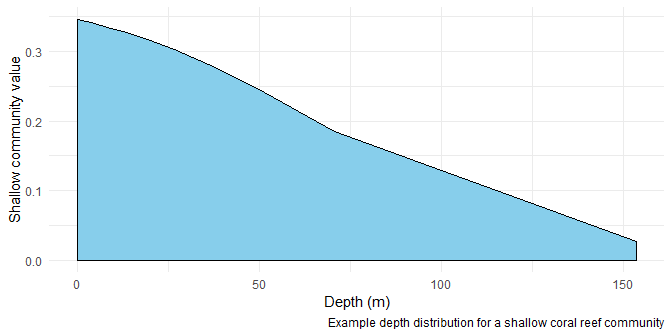

<!-- README.md is generated from README.Rmd. Please edit that file -->

# MCE <a href='https:/jack-h-laverick.github.io/MCE'></a>

<!-- badges: start -->

<!-- badges: end -->

MCE is an R package for modelling the vertical distribution of coral
communities across depth gradients. MCE currently contains a light
driven mechanistic model of the transition from shallow to mesophotic
reefs. The goal for the future is to allow the research community to
include additional mechanisms. These models can provide useful null
hypotheses, and help us to quantify the importance of missing ecosystem
level processes.

## Installation

You can install the released version of MCE from
[CRAN](https://CRAN.R-project.org) with:

``` r
install.packages("MCE")
```

And the development version from [GitHub](https://github.com/) with:

``` r
# install.packages("devtools")
devtools::install_github("Jack-H-Laverick/MCE")
```

## Example

MCE is largely split into functions which control the environment with
depth, and functions which control community relationships to the
environment. The following code shows how to build a light gradient with
depth:

``` r
library(MCE)

light.intervals <- seq(0.1, 1, length.out = 10) # Choose light levels to calculate depths for

depths <- depth(light.intervals, KdPAR = 0.03)  # Calculate depths specifying light attenuation

plot(x = depths, y = light.intervals)           # Quick plot
```


We can then specify how a coral community will respond to an
environmental gradient:

``` r
light.intervals <- seq(0.1, 100, length.out = 10) # Choose light levels to calculate community values for

community <- shallow(light.intervals)             # Calculate community values

plot(y = community, x = light.intervals)          # Quick plot
```


Combining the environment and community functions allows you to project
a depth distribution:

``` r
library(dplyr, warn.conflicts = F)
library(ggplot2)

data.frame(light.intervals = seq(0.1, 1, length.out = 10)) %>%                # Choose light levels
    mutate(depths = depth(light.intervals, KdPAR = 0.03),                     # Calculate depths
           community = shallow(light.intervals * 100)) -> depth.distribution  # Calculate community values

ggplot(depth.distribution) +                                                  # Plot
  geom_area(aes(y = community, x = depths), fill = "skyblue", colour = "black") + 
  theme_minimal() +
  labs(x = "Depth (m)", y = "Shallow community value",
       caption = "Example depth distribution for a shallow coral reef community")
```


